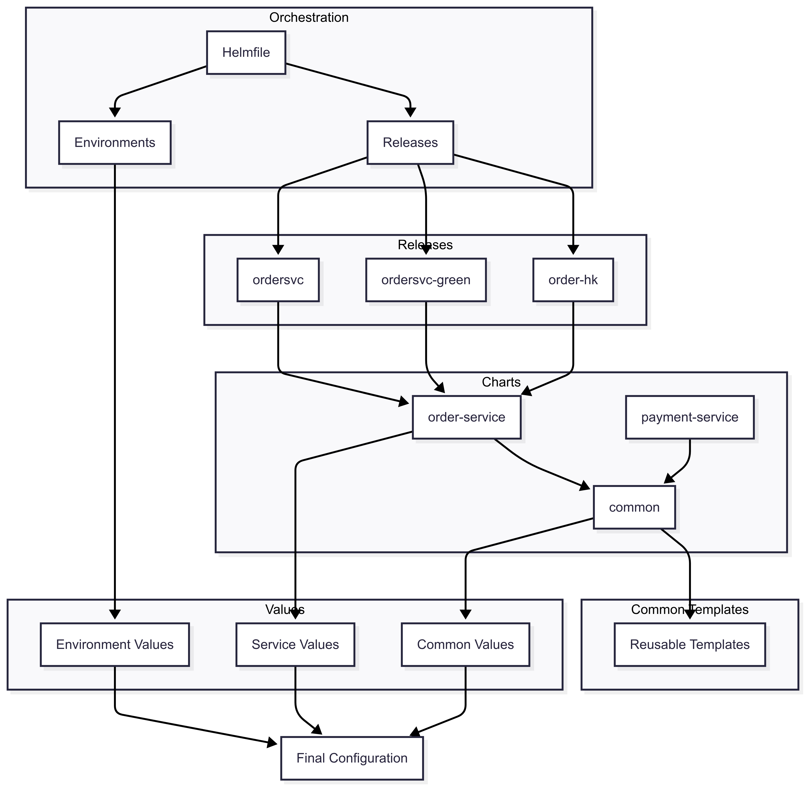

# Helm Chart

Using one Helm Chart template to manage all microservices CRDs.

## Key Design Features

- **Common Template Pattern** : uses a common chart with reusable templates.

- **Environment Management** : Multiple environments (dev, sit, uat, staging, prod) are managed through environment-specific values files.

- **Regional Deployment Support** : supports regional-specific deployments (e.g., HK region) through specialized values files.

- **Blue/Green Deployment** : supports blue/green deployment patterns.

- **Helmfile Orchestration** : manage multiple releases and environments, providing a higher-level abstraction over Helm.

- **Templating System** : uses Helm's templating system extensively, to maintain consistency across resources.

- **Microservices Architecture** : support multiple microservices (e.g. order-service, payment-service) with shared configuration patterns.

## Architecture



## Prerequisites

- Helm
- Helmfile

## Template debug

```shell
helmfile -e dev template > debug.yaml
```

## Dry run

```shell
helmfile -e dev template > dry-run-dev.yaml
```

## Apply

```shell
helmfile -e dev apply
```
